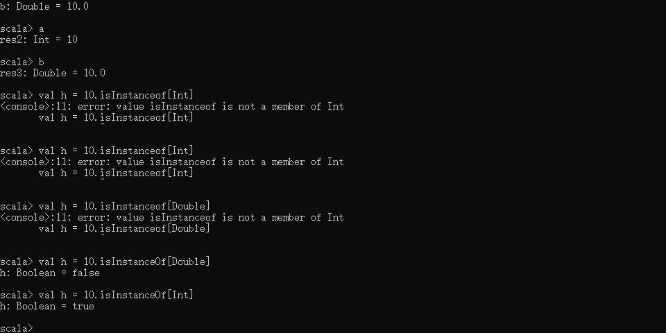

[TOC]

------


## 0	Hello World

```scala
object HelloWorld{
    def main(args : Array[String]){  
        println("Hello World")
    }
}
```

如上代码可以看到，

1. def main 是一个**入口函数**
2. scala的代码每行并不强求使用`;`进行解结束，但是对于JAVA来说是必须的；
3. scala的变量定义在前面args，类型定义在后面，用冒号`：`进行分割


## 1	scala入门

### 1.1	val和var的区别

- val ：值

  final，不可变

  val  值名称:类型 = xxx

  如:   _val age : Int = 20_

- var ：变量

  赋值之后可以改变

  var 变量名:类型 = xxx

  如：

  ```scala
  var name:String = “zhangsan”
  name:String = "张思"
  name = "张五" //数据类型可以省略
  ```

### 1.2	基本数据类型

#### 1.2.1	常用类型

- Bytee/Char
- Short/Int/Long/Float/Double
- Boolean

```scala
val a:Int= 10
val b:Boolean = true
val c = False
val d = 1.1 //double
val d:Float = 1.1 //会报错，因为从上面可以看到1.1是double类型
val d:Float = 1.1f //不会报错，f指float
val d:1.1f //==>Float类型
```


#### 1.2.2	类型转换

`asInstanceOf`类型转换函数

```scala
val f = 10 //这个f是个int类型，如果想要将其转换为double
val g = 10.asInstanceOf[Double]
val h = g.asInstanceOf[Long]
```

#### 1.2.3	判断类型

`isInstanceof`判断类型函数

```scala
>>>val h = 10.isInstanceOf[Int]
>>>h: Bolean = true

>>>val h = 10.isInstanceOf[Double]
>>>h: Bolean = false
```



### 1.3	lazy机制

- 例1


- 例2

  正常情况下：

  

  但是，当我们的文件路径错误时：

  

  只有在真正调用这个变量的时候才会报错，但是`val a `方式时则立即会报错

## 2	函数

### 2.1	函数定义


```scala
def 方法名(参数名：参数类型):返回值类型 = {
//括号内的叫做方法体

//方法体内最后一行为返回值，不需要return
}
```

```scala
package com.imooc.scala.course03

object FunctionApp {
  def main(args: Array[String]): Unit = {
    println(add(2, 3))
    println(three())
    say_hello()
  }
  def add(x: Int, y:Int):Int = {
    x+y
  }

  def three() = 1+2 //当函数或者方法没有入参的时候，花括号可以不写

  def say_hello(): Unit ={ //函数没有返回值的时候，会自动补充数据类型unix
    println("say: hello")
  }
}
```


定义的方法，都会在**main方法中调用和执行**，当然main函数也可以写函数体。
